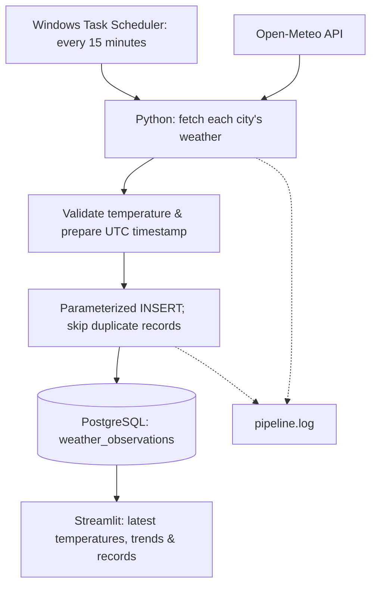

<h1 align="center">🌦️ Weather Data Pipeline</h1>
<p align="center"><strong>From weather API to stored history to a dashboard.</strong></p>
<p align="center">Python · PostgreSQL · Pandas · Streamlit</p>

<p align="center">
  
  
  
  
</p>

<p align="center">
  <a href="#architecture">Architecture</a> ·
  <a href="#getting-started">Setup</a> ·
  <a href="#dashboard">Dashboard</a> ·
  <a href="#testing">Testing</a> ·
  <a href="#design-decisions">Design decisions</a>
</p>

---

## Overview

A data engineering learning project that collects current temperatures for **Helsinki, London, and Berlin**, validates the API response, and stores records in PostgreSQL. A Streamlit dashboard reads the saved data to display latest temperatures and historical trends.

One run processes the three cities as a batch. Windows Task Scheduler runs the batch every 15 minutes on the local computer, providing near-real-time collection. History grows as new weather timestamps are collected.

## Architecture



**Collection and display are separate:** `main.py` writes records; `dashboard.py` queries them. Opening or refreshing the dashboard does not call the weather API.

## Implemented features

| Capability | Implementation |
|---|---|
| Multi-city collection | A list of city coordinates processed sequentially |
| Basic validation | Rejects missing temperature and prepares numeric values |
| Consistent timestamps | Requests GMT and labels the weather datetime as UTC |
| Persistent history | PostgreSQL stores records across program runs |
| Duplicate prevention | Unique constraint on city, weather time, and source |
| API retries | Up to two retries after the initial request for eligible failures |
| Per-city error handling | A failed city is logged while the others are attempted |
| Execution visibility | Timestamped console/file logs and batch totals |
| Exit status | `0` for success, including duplicates; `1` if a city fails |
| Analytics | Latest saved temperatures, a history chart, and a records table |

## Getting started

### 1. Prepare the environment

Install Python, PostgreSQL, and optionally pgAdmin. Internet access is needed for collection. Use a Python version compatible with the packages pinned in `requirements.txt`.

The following commands use **Windows PowerShell**:

```powershell
git clone https://github.com/Neupane-pradip/weather-data-pipeline.git
cd weather-data-pipeline
python -m venv .venv
.\.venv\Scripts\python.exe -m pip install -r requirements.txt
```

Using the virtual environment's Python directly avoids needing to activate it.

### 2. Create the database and table

In pgAdmin, connect to your local PostgreSQL server:

1. Right-click **Databases → Create → Database**.
2. Name it `weather_pipeline`.
3. Open the Query Tool for that database.
4. Execute the contents of [sql/schema.sql](sql/schema.sql).

Alternatively, if PostgreSQL's command-line tools are on your PATH:

```powershell
createdb -h localhost -p 5432 -U postgres weather_pipeline
psql -h localhost -p 5432 -U postgres -d weather_pipeline -f sql\schema.sql
```

Skip database creation if it already exists. `CREATE TABLE IF NOT EXISTS` creates a missing table; it does not migrate an existing table's structure.

### 3. Configure the connection

```powershell
Copy-Item .env.example .env
```

Edit `.env` with your local settings:

```dotenv
DB_HOST=localhost
DB_PORT=5432
DB_NAME=weather_pipeline
DB_USER=postgres
DB_PASSWORD='replace_with_your_password'
```

Both scripts load `.env` from the project folder. `.gitignore` excludes credentials, virtual environments, and generated logs. The supplied settings use the local `postgres` account for learning; deployment should use an application account with limited permissions.

### 4. Collect the first batch

```powershell
.\.venv\Scripts\python.exe main.py
```

Example batch summary; counts vary with existing records:

```text
INFO | Batch finished: 3 inserted, 0 skipped, 0 failed.
```

Run again with unchanged weather timestamps and the matching observations are skipped. Logs are appended to `pipeline.log`.

## Dashboard

```powershell
.\.venv\Scripts\python.exe -m streamlit run dashboard.py
```

Open the Local URL printed in the terminal, usually `http://localhost:8501`.

The dashboard displays:

- **Latest saved temperature** for each city, with its weather timestamp.
- **Temperature history** grouped by city.
- **Stored records** ordered from newest weather timestamp to oldest.

Click **Refresh saved data** to query PostgreSQL again. The dashboard does not automatically refresh on a timer. Keep its terminal running; press **Ctrl+C** to stop it.

## Database design

One row represents a weather value for a city, weather timestamp, and provider.

| Column | Type | Purpose |
|---|---|---|
| `id` | `BIGINT` identity | Generated primary key |
| `city` | `TEXT` | City label |
| `weather_time_utc` | `TIMESTAMPTZ` | Weather timestamp supplied by the API |
| `temperature_c` | `DOUBLE PRECISION` | Temperature in Celsius |
| `source` | `TEXT` | Data provider |
| `collected_at` | `TIMESTAMPTZ` | Database insertion timestamp |

The schema requires values in every column and enforces:

```sql
UNIQUE (city, weather_time_utc, source)
```

Insertion uses `ON CONFLICT ... DO NOTHING`. Repeated collection leaves the existing row unchanged, even if the API revises the value for that same timestamp.

Inspect recent weather in pgAdmin:

```sql
SET TIME ZONE 'UTC';

SELECT city, weather_time_utc, temperature_c, collected_at
FROM weather_observations
ORDER BY weather_time_utc DESC, city
LIMIT 20;
```

The database owns the stored records. `schema.sql` contains instructions to recreate the table, not a copy of its data.

## Scheduling on Windows

Create a task in **Windows Task Scheduler → Create Task**:

| Setting | Value |
|---|---|
| Name | `Weather Pipeline` |
| Security option | Run only when user is logged on |
| Trigger | One-time start with a 15-minute repetition, indefinitely |
| Program/script | Absolute path to `.venv\Scripts\python.exe` |
| Arguments | Quoted absolute path to `main.py` |
| Start in | Absolute project folder, without quotes |
| If already running | Do not start a new instance |

Use paths from your own checkout. Enable **Run task as soon as possible after a scheduled start is missed** and adjust battery conditions to suit your laptop.

Run the task manually first. Check **Last Run Result = 0x0**, new entries in `pipeline.log`, and stored records. Then verify a run triggered by the schedule.

The computer must be awake, the user logged in, PostgreSQL running, and internet available. A catch-up run fetches current weather; it does not backfill every missed interval. The task is configured locally, not created automatically by cloning this repository.

## Testing

```powershell
.\.venv\Scripts\python.exe -m unittest test_retries -v
```

The test starts a temporary server on the loopback interface:

```text
First GET → 503 temporary failure → automatic retry → 200 success
```

It verifies that `fetch_weather()` makes two requests and returns the successful JSON. It needs neither PostgreSQL nor the live weather API.

This is one targeted retry test. Exhausted retries, database failures, and additional validation cases are not yet covered by automated tests.

## Design decisions

- **A small stack:** Python and PostgreSQL make the full pipeline visible without configuring a distributed cluster.
- **Separate stages:** extraction, transformation, and loading are reusable functions.
- **Two timestamps:** weather time describes the value; collection time describes its arrival.
- **Per-city commits:** successful cities remain stored if a later city fails.
- **Bounded retries:** eligible connection failures and selected HTTP errors get another attempt. Invalid coordinates are not retried.
- **A separate dashboard:** analytics reads stored history independently of collection.

## Project structure

```text
weather-data-pipeline/
├── main.py              # Extraction, transformation, loading & logs
├── dashboard.py         # PostgreSQL queries & Streamlit display
├── test_retries.py      # Local temporary-failure recovery test
├── requirements.txt     # Pinned Python environment dependencies
├── sql/
│   └── schema.sql       # Table definition & constraints
├── .env.example         # Connection settings template
├── .gitignore
└── README.md

Generated locally, excluded from Git:
.env · .venv/ · pipeline.log · __pycache__/
```

## Troubleshooting

| Symptom | What to check |
|---|---|
| Connection refused | PostgreSQL service, host, and port |
| Password authentication failed | `DB_USER` and `DB_PASSWORD` in `.env` |
| Missing configuration key | `.env` exists and contains all five connection settings |
| Table does not exist | Execute `sql/schema.sql` in the correct database |
| No dashboard records | Run collection and verify records in PostgreSQL |
| Everything is skipped | Existing city–time–source records; this is expected |
| Scheduled run fails | Task action paths, account, conditions, and `pipeline.log` |
| Temporary API failures | Logs and retry exhaustion; subsequent cities are still attempted |

## What I learned

API requests and JSON parsing; Python functions, loops, and exceptions; UTC handling; SQL schemas and constraints; database transactions; repeatable collection; logging; testing; scheduling; and turning stored records into a dashboard.

## Next improvements

- [ ] Historical backfills and incremental loading
- [ ] More weather fields and stronger response validation
- [ ] Tests for retry exhaustion, validation, and database behavior
- [ ] Continuous integration
- [ ] Dashboard freshness indicators and automatic refresh
- [ ] Log rotation and a read-only dashboard database account
- [ ] Reproducible deployment and scheduler configuration

## Author

**[Pradip Neupane](https://github.com/Neupane-pradip)**  
MSc Data Science student at Tampere University, building a data engineering portfolio.
